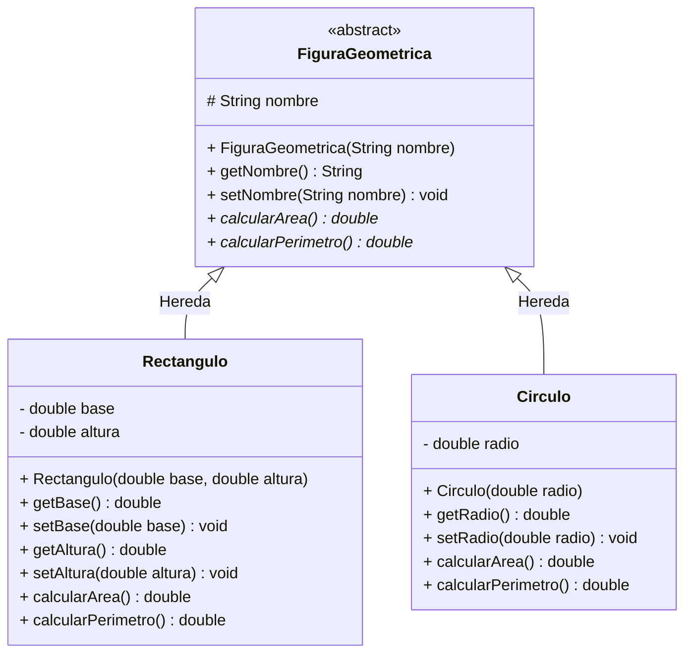

# Proyecto ejemplo-geometria

Aplicación de consola Java que aplica los principios de la Programación Orientada a Objetos (POO) —como **Herencia**, **Abstracción**, **Encapsulamiento** y **Polimorfismo**— para calcular el área y perímetro de distintas figuras geométricas. Además, guarda y carga las figuras creadas en un archivo **JSON** usando la librería **Jackson** (serialización/deserialización).

---

## 🛠️ Estructura del Proyecto

```text
ejemplo-geometria/
├── lib/
│   ├── jackson-annotations-2.17.0.jar
│   ├── jackson-core-2.17.0.jar
│   └── jackson-databind-2.17.0.jar
├── src/
│   └── com/
│       └── geometria/
│           ├── model/
│           │   ├── FiguraGeometrica.java  (Clase padre abstracta)
│           │   ├── Rectangulo.java        (Clase hija)
│           │   └── Circulo.java           (Clase hija)
│           └── Main.java                  (Punto de entrada y menú)
├── bin/                                   (Archivos .class compilados)
├── figuras.json                           (Generado al guardar)
└── README.md
```

---

## 📐 Diagrama de Clases (Mermaid)



---

## 📋 Especificación de Clases

### 1. `FiguraGeometrica` (Clase Padre Abstracta)
Define el contrato base para todas las figuras del sistema.

* **Atributos:**
  * `# nombre: String` (Protegido)
* **Métodos:**
  * `+ FiguraGeometrica(String nombre)`: Constructor.
  * `+ calcularArea(): double`: Método abstracto a implementar por las subclases.
  * `+ calcularPerimetro(): double`: Método abstracto a implementar por las subclases.

### 2. `Rectangulo` (Clase Hija)
Representa un rectángulo bidimensional.

* **Atributos Privados:**
  * `- base: double`
  * `- altura: double`
* **Fórmulas:**
  * Área = base * altura
  * Perímetro = 2 * (base + altura)

### 3. `Circulo` (Clase Hija)
Representa un círculo bidimensional.

* **Atributos Privados:**
  * `- radio: double`
* **Fórmulas:**
  * Área = π * radio²
  * Perímetro = 2 * π * radio

> **Nota sobre serialización:** `FiguraGeometrica` está anotada con `@JsonTypeInfo` y `@JsonSubTypes` de Jackson. Esto agrega el campo `"tipo"` al JSON y permite que, al deserializar la lista, se instancie la subclase correcta (`circulo` o `rectangulo`). Todas las clases tienen constructor vacío, requisito para que Jackson deserialice.

---

## 💻 Compilación y Ejecución desde Terminal

### 1. Ubicación
Asegúrate de estar posicionado en la raíz del proyecto (`ejemplo-geometria`).

### 2. Compilar los archivos Java
Compila todos los archivos de origen y coloca los archivos binarios (`.class`) en la carpeta `bin`. El classpath (`-cp "lib/*"`) incluye las librerías Jackson:

```bash
javac -cp "lib/*" -d bin src/com/geometria/model/*.java src/com/geometria/*.java
```

### 3. Ejecutar la aplicación
Ejecuta la clase principal indicando el classpath:

```bash
java -cp "bin:lib/*" com.geometria.Main
```

---

## 🚀 Flujo de Ejecución en Consola (`Main`)

1. El programa despliega un menú interactivo:
   * `1.` Crear Rectángulo
   * `2.` Crear Círculo
   * `3.` Ver figuras creadas
   * `4.` Guardar figuras en JSON (`figuras.json`)
   * `5.` Cargar figuras desde JSON
   * `6.` Salir
2. Solicita al usuario las dimensiones correspondientes (validadas para ser números positivos).
3. Utiliza **Polimorfismo** instanciando las subclases bajo la referencia de `FiguraGeometrica` y las acumula en una `List<FiguraGeometrica>`.
4. `Guardar` serializa la lista a JSON; `Cargar` la deserializa de vuelta (persistencia entre ejecuciones). El archivo `figuras.json` se crea en la raíz del proyecto.

### Ejemplo de `figuras.json` generado

```json
[ {
  "tipo" : "rectangulo",
  "nombre" : "Rectángulo",
  "base" : 5.0,
  "altura" : 3.0
}, {
  "tipo" : "circulo",
  "nombre" : "Círculo",
  "radio" : 4.0
} ]
```